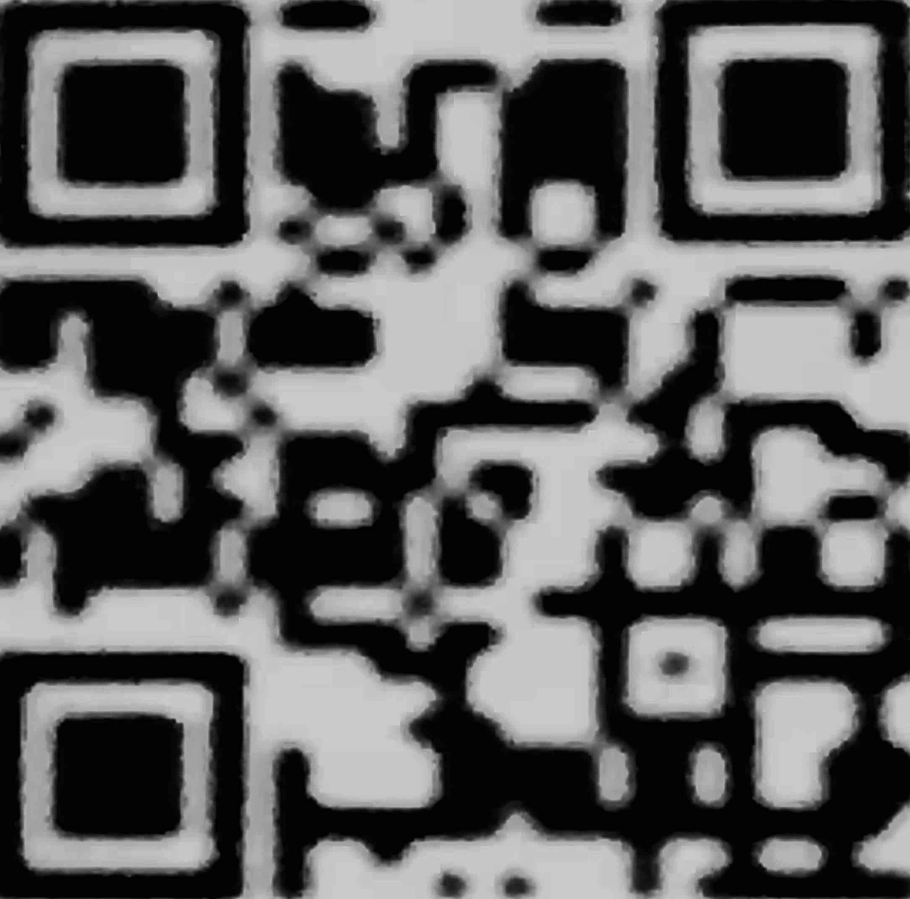

# QR Code Sharpener

This little utility tries to recreate a QR code from a blurry picture.

## Trying it out

This project is hosted at [https://haraldf.github.io/qrsharpener/](https://haraldf.github.io/qrsharpener/).

## Usage from node.js

```bash
npm install
npx ts-node ./sharpener.ts <image.jpg>
```

Pass your jpeg image as only parameter to `sharpener.ts`. This will output two files, `res.jpg` with the detected QR code and `res_annotated.jpg` with the annotated original image. The annotated image contains one red dot showing where this tool thinks the center of each block is. If the red dots are off, use an image manipulation program to crop/transform the image.

For QR codes of other dimensions than 29x29, please edit `sharpener.ts` and set the `dimension` variable. You can also play with `colorThreshold` which tells the tool which RGB threshold to consider white or black.

## Usage in a browser

```bash
npm install
npm start
```

Uses the excellent `parcel` utility to serve a small webpage so you can try the tool in a browser. Open [localhost:1234](http://localhost:1234/) in your favorite browser after running the commands above.

## History

While watching the very funny comedian David Ryan Spaulding, a small video played with a QR code in the corner. Thinking that it was an easter egg, I snapped a quick photo with my phone:



 But alas, the room was dark and the image was blurry. None of the QR code recognizers would work at all. So I sat down and did a little weekend hack, basically segmenting the QR code into 29x29 pieces and assigning a color (white or black). First, I thought I need to do quite some heuristics, but then it turned out that simply taking the center pixel of each block was good enough. And behold - I generated a 29x29 pixel image that (after zooming in a bit) every QR code reader would understand:

 

To my dismay, the QR code in my photo was not an easter egg but just a reminder to buy the video converter that David apparently used.

Oh well, maybe the tool might be useful for other people, too, so here you go, feel free to try it out :)
